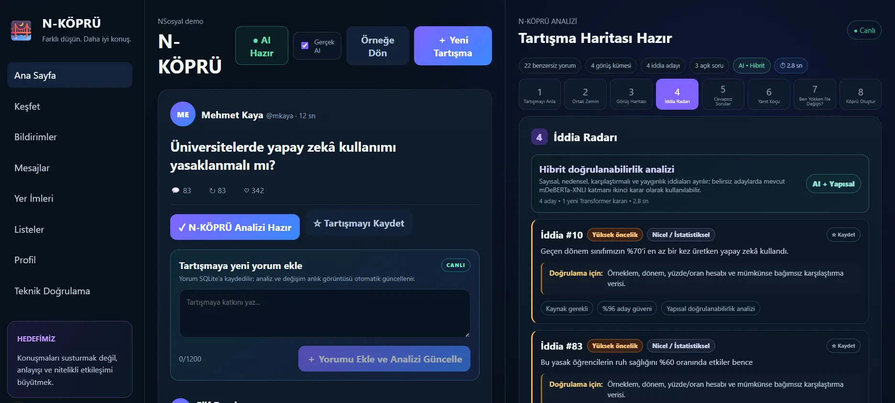
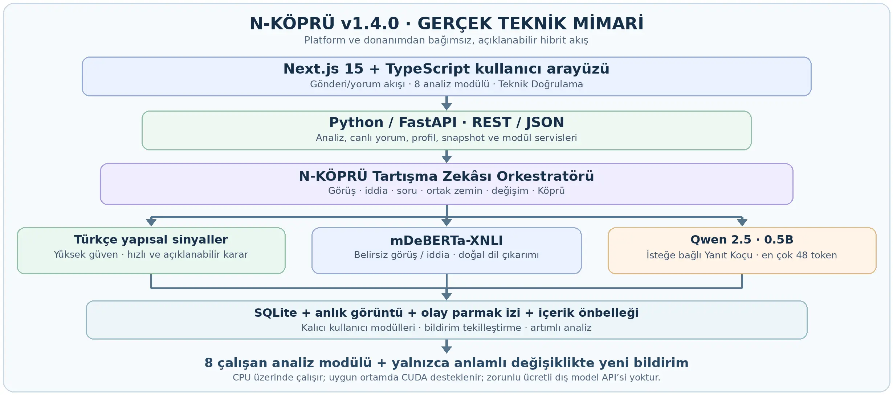
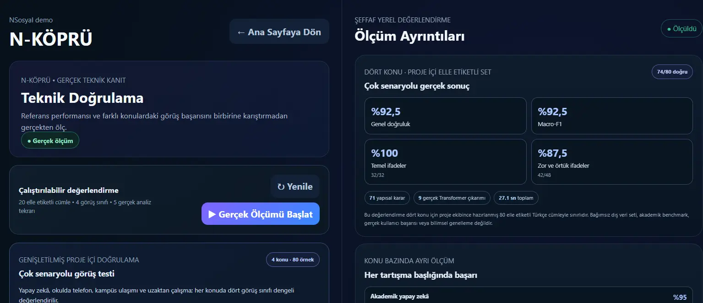

# N-KÖPRÜ

### Yapay Zekâ Destekli Sosyal Tartışma Zekâsı Sistemi

**TEKNOFEST 2026 · N’Sosyal İnovasyon Yarışması · Sosyal Yapay Zekâ**

N-KÖPRÜ, yüksek hacimli sosyal medya tartışmalarındaki görüşleri, ortak
zemini, temel ayrışmaları, doğrulanabilir iddiaları ve cevapsız soruları
görünür hâle getiren çalışan bir tartışma analiz platformudur. Amaç,
konuşmaları susturmak değil; anlayışı ve nitelikli etkileşimi büyütmektir.

| Sabit v1.4.0 Macro-F1 | Sabit v1.4.0 sınıflandırma | v1.5.0 otomatik testler | Çalışan analiz adımı |
|:---:|:---:|:---:|:---:|
| **%92,5** | **74 / 80 doğru** | **1.232 / 1.232 başarılı** | **8 modül** |

> Kalite sonuçları sabit `v1.4.0` TEKNOFEST teslimindeki 80 elle
> etiketlenmiş **proje içi** doğrulamaya aittir. Yeni `v1.5.0` finalist
> geliştirme sürümünde 1.232 otomatik test çalışır ve önceki 80 örnekten tamamen ayrı
> yeni bir iç kontrol sunulur. Her iki ölçüm de proje içidir; bağımsız
> akademik benchmark, dış veri başarısı veya kullanıcı performansı değildir.

**Etkin finalist geliştirme sürümü:** `v1.5.0` ·
**Değiştirilmeyen TEKNOFEST teslimi:** [`v1.4.0-teknofest-final`](https://github.com/yfurkan/N-KOPRU/tree/v1.4.0-teknofest-final)

`v1.5.0`, finalist sunumu için hazırlanmış geliştirme dalıdır: **Sunum
Modu**, canlı sistem hazırlık denetimi, anonim **Etki Pilotu**, mobil
çekmeceler, klavye erişilebilirliği, gizlilik modu ve güvenlik kapısı içerir.
Sabit yarışma teslimi geriye dönük olarak değiştirilmez.



## Hangi problemi çözüyor?

Uzun sosyal medya tartışmalarında tekrar eden yorumlar, karşıt görüşler,
kanıtsız iddialar ve yanıtlanmamış sorular birbirine karışır. N-KÖPRÜ,
tartışmayı okunabilir bir bilgi haritasına dönüştürür; farklı tarafların
gerçekte nerede ayrıştığını ve hangi ortak ölçütlerle konuşabileceklerini
açıkça gösterir.

## Sekiz çalışan analiz modülü

| Adım | Modül | Üretilen çıktı |
|:---:|---|---|
| 1 | **Tartışmayı Anla** | Tartışma özeti, temel ayrışmalar ve ölçülebilir göstergeler |
| 2 | **Ortak Zemin** | Karşıt görüşler arasında kesişen tema ve gerekçeler |
| 3 | **Görüş Haritası** | Görüş kümeleri, temsilci yorumlar ve kümeler arası ilişkiler |
| 4 | **İddia Radarı** | Doğrulanabilir iddia adayları, öncelik ve gerekli kanıt türü |
| 5 | **Cevapsız Sorular** | Kaynak/bilgi soruları, yanıt bağlantıları ve öncelik |
| 6 | **Yanıt Koçu** | Yapıcı ve güvenli yanıt önerileri |
| 7 | **Ben Yokken Ne Değişti?** | Anlık görüntüler arasındaki gerçek içerik değişiklikleri |
| 8 | **Köprü Oluştur** | Ortak kabul, temel ayrışma ve kısa köprü sorusu |

**Kalıcı ürün modülleri:** Profil, analiz geçmişi, anlık görüntü
karşılaştırması, anlamlı değişiklik odaklı bildirimler, mesajlar, yer imleri,
listeler ve teknik doğrulama. Kullanıcı verileri SQLite üzerinde kalır;
silinen bildirimler yeniden üretilmez.

## Teknik mimari



| Katman | Kullanılan teknoloji |
|---|---|
| Web arayüzü | Next.js 15.5.25, React 19 ve TypeScript |
| HTTP API | FastAPI, Pydantic ve Uvicorn |
| Görüş ve iddia analizi | Türkçe yapısal sinyaller + `MoritzLaurer/mDeBERTa-v3-base-mnli-xnli` |
| İsteğe bağlı Yanıt Koçu | Ayrı ve yerel `Qwen/Qwen2.5-0.5B-Instruct` katmanı |
| Kalıcılık | SQLite, anlık görüntüler, olay parmak izleri ve içerik önbelleği |

Hibrit motor, yüksek güvenli Türkçe yapısal sinyallerle çözülebilen
ifadelerde gereksiz model çıkarımı yapmaz. Belirsiz yorumlarda mDeBERTa-XNLI
devreye girer. Üretken Qwen modeli yalnızca isteğe bağlı Yanıt Koçu
akışının parçasıdır; bütün analizler için zorunlu bir dış LLM API çağrısı
veya ücretli token servisi kullanılmaz.

Uygulama **CPU üzerinde çalışabilir**. Uyumlu GPU hızlandırması isteğe
bağlıdır; belirli bir bilgisayar veya ekran kartı modeli zorunlu değildir.

## v1.5.0 — Finalist sunum ve etki hazırlığı

- **Sunum Modu:** 4:30 sayaç, beş adımlı jüri hikâyesi, canlı demo
  bağlantıları ve 5/5 zorunlu hazırlık kontrolü.
- **Etki Pilotu:** 8–12 gerçek katılımcı hedefli, anonim AB/BA karşılaştırması;
  ham yorum okuma ile N-KÖPRÜ analizini iki konu üzerinde karşılaştırır.
- Süre, doğruluk, anlaşılırlık ve güven ölçülür; deneme/yarım oturumlar
  sonuçlara katılmaz ve minimum örneklemden önce sonuç çıkarılmaz.
- SQLite bütünlüğü, ürün şeması, demo sözleşmesi, 8 analiz çıktısı ve Köprü
  sınırı `/api/system/readiness` ile tek istekte denetlenir.
- Mobil menü/analiz çekmecesi, skip-link, canlı bölge, görünür focus,
  ok tuşlarıyla sekme gezinmesi ve varsayılan gizlilik modu kullanılabilir.
- Next.js `15.5.25` güvenlik güncellemeleriyle sabitlendi; üretim bağımlılık
  taramasında **0 açık** bulundu.
- **54 test paketi / 1.232 başarılı test**, başarılı TypeScript ve üretim
  derlemesi, ayrıca **12/12 API kabul dumanı** tamamlandı.

Gerçek pilot katılımcısı henüz bulunmadığı için bu sürüm kullanıcı etkisi
sonucu iddia etmez; pilot ekranı ve CSV kanıt akışı gerçek oturumlara hazırdır.

Kullanım için [`docs/FINALIST_RUNBOOK.md`](docs/FINALIST_RUNBOOK.md), pilot
tasarımı için [`docs/USER_PILOT_PROTOCOL.md`](docs/USER_PILOT_PROTOCOL.md),
gizlilik için [`docs/PRIVACY_AND_AI_TRANSPARENCY.md`](docs/PRIVACY_AND_AI_TRANSPARENCY.md)
okunmalıdır.

## v1.4.2 — Konuya duyarlı tartışma dili ve ayrılmış iç kontrol (önceki geliştirme)

Görüş Haritası, Tartışmayı Anla ve Köprü Oluştur artık aynı ortak konu
bağlamını kullanır. Örneğin uzaktan çalışma tartışmasında görüş kümeleri
`Uzaktan çalışmanın devamını savunanlar`, `Ofis zorunluluğu veya daha güçlü
sınırlama` ve `Kurallı veya hibrit çalışma` olarak görünür. Kayıtlı kanonik
görüş kimlikleri değişmez; SQLite geçmişi, olay parmak izleri, bildirim
tekilleştirme ve mevcut akademik yapay zekâ demosu korunur.

Teknik Doğrulama ekranında üçüncü ve ayrı bir düğme ile önceki dört konulu
80 örnekten farklı **beş yeni konuda 80 yeni elle etiketlenmiş ifade**
değerlendirilir:

| Yeni tartışma konusu | Örnek sayısı | Modelsiz yapısal/yedek sonuç |
|---|:---:|:---:|
| Mahalle parkı erişimi | 16 | 14 / 16 |
| Okul kantini beslenmesi | 16 | 14 / 16 |
| Kentte geri dönüşüm | 16 | 14 / 16 |
| Halk kütüphanesi erişimi | 16 | 14 / 16 |
| Çocuklarda dijital oyun | 16 | 14 / 16 |
| **Toplam** | **80** | **70 / 80** |

- Önceki kalibrasyon setiyle **0 ortak cümle ve 0 ortak konu** vardır;
  içerik `1b4e8cb55023d1a1b99e32a2029ff3fd5c0a00f55dd79be6fb937453011fbdcf`
  SHA-256 parmak iziyle sabitlenmiştir.
- Model yüklenmeden gerçekleşen gerçek koşuda doğruluk **%87,5**, Macro-F1
  **%90,18** ve açıkça listelenen hata sayısı **10** olmuştur. mDeBERTa
  yüklendiğinde gerçek model çıktısına bağlı olarak sonuç değişebilir.
- Yeni iç kontrolün hataları bu sürümde kuralları yeniden ayarlamak için
  kullanılmamıştır; sonuç yapay biçimde %100'e çekilmez.
- Her konu için gerçek doğruluk, karışıklık matrisi, sınıf bazlı
  precision/recall/F1, kolay-zor kırılımı ve bütün yanlış yorumlar ayrı
  gösterilir. Kullanıcı yorumlarına başarı puanı uydurulmaz.
- Üç değerlendirme sonucu ayrı SQLite anahtarlarında saklanır; eski 20
  örnekli referans ve dört konulu 80 örnekli sonuç silinmez.
- **184 yeni regresyon testi** ile toplam **50 test paketinde
  1.164 / 1.164** otomatik kontrol başarılıdır.
- Bu sürüm, v1.5.0 finalist dalının temelini oluşturan yerel geliştirme
  paketidir; sabit yarışma teslim etiketi korunmuştur.

## v1.4.1 — Bağlama duyarlı görüş sınıflandırması

Bu geliştirme, sabit `v1.4.0` tesliminde açıkça gösterilen altı
sınıflandırma hatasının nedenlerini konu-bağımsız Türkçe anlam kurallarıyla
giderir:

- Erişimin, hizmetin veya iletişim hakkının sürmesini savunan örtük ifadeler
  destek olarak değerlendirilir.
- `denetimsiz`, `kuralsız` ve `şartsız` sözcükleri olumlu denetim/kural
  önerileriyle karıştırılmaz; gerçek olumlu koşullar korunur.
- Soru işareti olmadan yazılmış araştırma, kaynak ve kanıt talepleri tarafsız
  bilgi ihtiyacı olarak ayrılır.
- Uzaktan çalışma başlıklarında yalnızca ofiste çalışmayı zorunlu tutan
  ifadeler kısıtlayıcı görüş olarak yorumlanır; başka konulara aynı kural
  uygulanmaz.
- Hibrit Transformer ve modelsiz heuristik yedek, daha önce kullanılmamış
  **42 ayrı cümlede** aynı sınıflandırma davranışını korur.
- Aynı 80 örnekte **77 yapısal karar**, **3 gerçekten belirsiz model kararı**
  ve **13 açıklanabilir anlam koruması** doğrulanmıştır. Kontrollü testte
  kalan 3 yorum için deterministik model taklidi kullanıldığında sonuç
  **80 / 80** olmuştur; gerçek cihaz sonucu gerçek model çıktısına bağlıdır.
- Önceki hatalar iyileştirmede incelendiği için aynı 80 cümledeki yeni
  sonuç **bağımsız tutma testi değildir**; uygulama bu sınırı ekranda gösterir.
- **172 yeni regresyon testi** ile toplam **46 test paketinde 980 / 980**
  otomatik kontrol geçer. SQLite verileri, önbellek ve önceki ürün modülleri
  korunur.

## Ölçülmüş teknik doğrulama — sabit v1.4.0 teslimi



### Dört konuda 80 elle etiketlenmiş örnek

| Tartışma konusu | Doğru / toplam | Doğruluk |
|---|:---:|:---:|
| Akademik yapay zekâ | 19 / 20 | %95 |
| Okulda telefon kullanımı | 18 / 20 | %90 |
| Kampüste gece ulaşımı | 19 / 20 | %95 |
| Uzaktan çalışma | 18 / 20 | %90 |
| **Toplam** | **74 / 80** | **%92,5** |

- Dört görüş sınıfının her biri **20 örnekle** dengeli temsil edilir.
- Temel ifadeler: **32 / 32 doğru**; zor ve örtük ifadeler: **42 / 48 doğru**.
- **71** karar Türkçe yapısal sinyallerle, **9** karar gerçek Transformer
  çıkarımıyla üretilmiştir.
- **6 sınıflandırma hatası** gizlenmez; beklenen ve gerçekleşen görüşler
  Teknik Doğrulama ekranında ayrı ayrı gösterilir.
- Bir yerel CPU ölçümünde ilk/soğuk analiz yaklaşık **2,7–3,1 saniye**,
  önbellekli tekrar yaklaşık **10–12 milisaniye** sürmüştür. Süreler cihaza,
  model durumuna ve tartışma içeriğine göre değişir.

### Sınıf bazlı sonuçlar

| Görüş sınıfı | Precision | Recall | F1 | Destek |
|---|:---:|:---:|:---:|:---:|
| Destekleyen | %100 | %85 | %91,9 | 20 |
| Karşı / Sınırlayıcı | %81,8 | %90 | %85,7 | 20 |
| Koşullu / Dengeli | %95,2 | %100 | %97,6 | 20 |
| Soru / Tarafsız | %95 | %95 | %95 | 20 |

### Karışıklık matrisi

Satırlar elle belirlenen etiketi, sütunlar sistemin gerçek tahminini gösterir.

| Beklenen ↓ / Tahmin → | Destek | Karşı | Koşul | Soru |
|---|:---:|:---:|:---:|:---:|
| **Destek** | 17 | 3 | 0 | 0 |
| **Karşı** | 0 | 18 | 1 | 1 |
| **Koşul** | 0 | 0 | 20 | 0 |
| **Soru** | 0 | 1 | 0 | 19 |

## Sıfırdan kurulum

Önerilen gereksinimler: **Python 3.11 veya 3.12**, **Node.js 20+** ve Git.
Backend ve frontend iki ayrı terminalde çalıştırılır.

### 1. Kaynak kodu indir

```bash
git clone https://github.com/yfurkan/N-KOPRU.git
cd N-KOPRU
```

> GitHub'daki sabit TEKNOFEST teslim etiketi `v1.4.0` olarak korunur.
> Finalist geliştirme `finalist-v1.5.0` dalında ilerler; sabit teslim dalı
> jüri kanıtı olarak ayrıca korunur.

### 2. Backend — Windows / PowerShell

```powershell
cd backend
py -3.12 -m venv .venv
.\.venv\Scripts\Activate.ps1
python -m pip install --upgrade pip
pip install -r requirements.txt
uvicorn app.main:app --reload --port 8000
```

Python 3.12 yerine kurulu başka bir desteklenen sürüm kullanılıyorsa sanal
ortam `python -m venv .venv` komutuyla da oluşturulabilir.

### Backend — macOS / Linux

```bash
cd backend
python3 -m venv .venv
source .venv/bin/activate
python -m pip install --upgrade pip
pip install -r requirements.txt
uvicorn app.main:app --reload --port 8000
```

### 3. Frontend — ikinci terminal

Proje kök dizininden:

```bash
cd frontend
npm install
npm run dev
```

| Servis | Adres |
|---|---|
| Uygulama | http://localhost:3000 |
| Backend sağlık kontrolü | http://127.0.0.1:8000/health |
| Etkileşimli API dokümantasyonu | http://127.0.0.1:8000/docs |

### 4. Gerçek AI modelleri — isteğe bağlı

Backend sanal ortamı etkin durumdayken:

```bash
pip install -r requirements-ai.txt
```

Uygulamada AI modelini hazırla; ilk kullanımda ilgili model dosyaları
indirilebilir. AI paketleri olmadan uygulama, desteklenen yapısal/yedek
analiz davranışıyla açılır. GPU zorunlu değildir.

## Testleri çalıştırma

Backend dizininde ve sanal ortam etkinken:

```bash
pip install -r requirements-test.txt
python -m unittest discover -s tests -p "run_*.py" -v
```

Sabit `v1.4.0` tesliminde **43 test paketi ve 808 başarılı otomatik test**
bulunur. `v1.4.1` geliştirmesi bunu **46 pakette 980 başarılı teste**,
`v1.4.2` ise **50 pakette 1.164 başarılı teste** çıkarmıştır. `v1.5.0`,
pilot, hazırlık endpoint'i, mobil/erişilebilirlik ve sunum sözleşmelerini
ekler: **54 paket, 1.232 / 1.232 başarılı**.
Bildirim tekilleştirme, SQLite kalıcılığı, canlı tartışma, görüş tutarlılığı,
iddia önbelleği, sekiz analiz adımı ve arayüz sözleşmeleri test kapsamındadır.

Frontend kontrolleri:

```bash
npm run build
npx tsc --noEmit
```

## Depo düzeni

- [`backend/`](backend/): FastAPI API, analiz motorları ve 54 test paketi.
- [`frontend/`](frontend/): Next.js uygulaması ve kullanıcı arayüzü.
- [`docs/test-reports/`](docs/test-reports/): Bütün sürümlerin gerçek test,
  denetim, geçiş ve benchmark çıktıları.
- [`docs/release-notes/`](docs/release-notes/): Sürüm bazlı teslim notları.
- [`docs/screenshots/`](docs/screenshots/): Çalışan uygulama ekran görüntüleri.
- [`docs/architecture/`](docs/architecture/): Gerçek teknik mimari görseli.
- [`docs/CONFIGURATION.md`](docs/CONFIGURATION.md): İsteğe bağlı ortam
  değişkenleri ve çalışma yapılandırması.
- [`docs/FINALIST_RUNBOOK.md`](docs/FINALIST_RUNBOOK.md): Jüri sunumu ve ana
  kabul testi kılavuzu.
- [`docs/USER_PILOT_PROTOCOL.md`](docs/USER_PILOT_PROTOCOL.md): AB/BA pilot
  protokolü ve örneklem sınırı.
- [`docs/PRIVACY_AND_AI_TRANSPARENCY.md`](docs/PRIVACY_AND_AI_TRANSPARENCY.md):
  yerel veri, pilot gizliliği ve model sınırları.
- [`CHANGELOG.md`](CHANGELOG.md): Önceki bütün sürümlerin eksiksiz geçmişi.
- [`VERSION.txt`](VERSION.txt): Kaynak paketin uygulama sürümü.

Doğrudan teslim ve geliştirme kanıtları:

- [v1.4.2 test raporu](docs/test-reports/V1_4_2_TEST_RAPORU.txt)
- [v1.4.2 makine okunabilir test sonuçları](docs/test-reports/V1_4_2_TEST_SONUCLARI.json)
- [v1.4.2 sürüm notları](docs/release-notes/V1_4_2_RELEASE_NOTES.md)
- [v1.5.0 finalist test raporu](docs/test-reports/V1_5_0_TEST_RAPORU.txt)
- [v1.5.0 makine okunabilir test sonuçları](docs/test-reports/V1_5_0_TEST_SONUCLARI.json)
- [v1.5.0 sürüm notları](docs/release-notes/V1_5_0_RELEASE_NOTES.md)
- [v1.4.1 test raporu](docs/test-reports/V1_4_1_TEST_RAPORU.txt)
- [v1.4.1 makine okunabilir test sonuçları](docs/test-reports/V1_4_1_TEST_SONUCLARI.json)
- [v1.4.1 sürüm notları](docs/release-notes/V1_4_1_RELEASE_NOTES.md)
- [v1.4.0 test raporu](docs/test-reports/V1_4_0_TEST_RAPORU.txt)
- [v1.4.0 makine okunabilir test sonuçları](docs/test-reports/V1_4_0_TEST_SONUCLARI.json)
- [v1.4.0 sürüm notları](docs/release-notes/V1_4_0_RELEASE_NOTES.md)
- [Sabit TEKNOFEST teslim dalı](https://github.com/yfurkan/N-KOPRU/tree/v1.4.0-teknofest-final)

## Veri güvenliği ve ölçüm sınırları

- `.env`, veritabanları, sanal ortamlar, `node_modules`, derleme çıktıları
  ve özel anahtarlar kaynak depoya eklenmez.
- Kullanıcı içeriği ile elle etiketlenmiş doğrulama verisi birbirinden ayrı
  değerlendirilir; etiketsiz kullanıcı yorumlarına sahte doğruluk/F1 skoru
  atanmaz.
- Model güveni, yorumun doğruluğu veya kullanıcının haklılığı anlamına
  gelmez; yalnızca ilgili sınıflandırma kararına ilişkindir.
- Teknik sonuçlar proje içi doğrulamadır. Bağımsız veri seti, akademik
  genelleme veya tamamlanmış kullanıcı pilotu iddiasında bulunulmaz.

---

**N-KÖPRÜ:** Farklı düşün. Daha iyi konuş.
