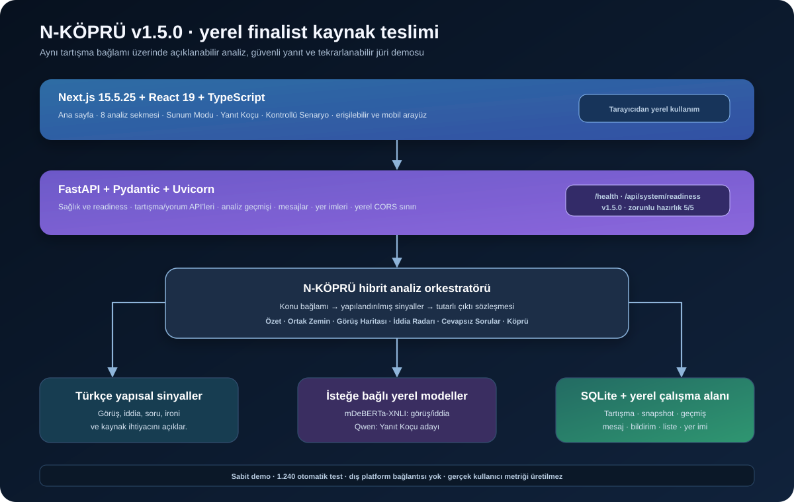

# N-KÖPRÜ — v1.5.0 finalist kaynak teslimi

N-KÖPRÜ, uzun sosyal tartışmaları okunabilir bir karar ve anlayış haritasına
dönüştüren yerel çalışan bir sosyal tartışma zekâsı uygulamasıdır. Sistem,
bir görüşü doğru ilan etmez veya kullanıcıya ne düşünmesi gerektiğini söylemez.
Yorumların hangi görüş kümelerinde toplandığını, hangi iddiaların kanıt
istediğini, hangi soruların açık kaldığını ve tarafların hangi ölçütlerde
ayrıştığını görünür hâle getirir.

## Bu klasör hangi sürümdür?

Bu paket **N-KÖPRÜ v1.5.0 finalist yazılımının `main` dalına gönderilecek
son kaynak durumudur**. Teknik rapor yarışmaya daha önce gönderilmiş temel
teslimi ve v1.4.0 ölçümlerini belgelemektedir; bu klasörün çalışan uygulama
sürümü v1.5.0’dır. Eski sürüm kayıtları yalnızca geçmişi izlemek için
`CHANGELOG.md`, `docs/release-notes/` ve `docs/test-reports/` altında tutulur.

| Kontrol | Sonuç |
|---|---:|
| Güncel uygulama sürümü | **v1.5.0** |
| Çalışan analiz modülü | **8** |
| Backend otomatik testi | **1.246 / 1.246** |
| Zorunlu hazırlık kontrolü | **5 / 5** |
| Frontend üretim derlemesi | **Başarılı** |
| Production bağımlılık denetimi | **0 açık** |

Bu sayılar proje içi yazılım doğrulamasıdır. Kullanıcı etkisi ölçümü, canlı
sosyal medya hesabı, dış platform senkronizasyonu, saha sonucu veya bağımsız
akademik benchmark sonucu olarak sunulmaz.

## Teslim kapsamı ve veri sınırı

- Uygulama FastAPI + Next.js + SQLite ile yerel bilgisayarda çalışır.
- Jüri demosu, depoya dahil sabit örnek tartışma üzerinden tekrarlanabilir.
- Canlı sosyal medya hesabına, dış yorum akışına veya ücretli dış LLM API’sine
  bağlantı yoktur.
- Kullanıcı isterse ana ekrandan kendi yerel tartışma örneğini girebilir; bu
  veri yalnızca çalıştırılan yerel SQLite sürecinde tutulur ve GitHub’a
  gönderilmez.
- `Kontrollü Senaryo` ekranı iki sabit senaryoda ham yorum akışı ile
  N-KÖPRÜ görünümünü gösterir. Bu akış gerçek kullanıcı verisi toplamaz,
  gerçek etki metriği üretmez ve dışa aktarılabilir kullanıcı sonucu sunmaz.
- `.env`, veritabanı, model önbelleği, sanal ortam, `node_modules` ve derleme
  çıktıları `.gitignore` ile kaynak tesliminin dışında tutulur.

## Sekiz analiz modülü

| Sıra | Modül | Yöntem ve çıktı |
|---:|---|---|
| 1 | **Tartışmayı Anla** | Yorumları tek tek değerlendirir; kısa özet, yorum sayısı, görüş dağılımı ve ana ayrışmaları üretir. |
| 2 | **Ortak Zemin** | Farklı görüş kümelerinde tekrar eden tema ve gerekçeleri çapraz yorum kanıtlarıyla çıkarır. |
| 3 | **Görüş Haritası** | Yorumları destekleyen, karşı/sınırlayıcı, koşullu/dengeli ve soru/tarafsız kümelerine ayırır; her küme için temsilci yorum ve gerekçe gösterir. |
| 4 | **İddia Radarı** | Sayı, neden-sonuç, karşılaştırma ve doğrulanabilir olgu iddialarını aday olarak işaretler; hangi kanıtın gerektiğini açıklar. |
| 5 | **Cevapsız Sorular** | Bilgi veya kaynak isteyen soruları, bunlara cevap veren yorumları ve sorunun hangi görüşleri etkilediğini birlikte gösterir. |
| 6 | **Yanıt Koçu** | Hakareti ve kişisel saldırıyı çıkarır; kaynak talebini, sayıyı, soruyu, ironi/koşul ve ana görüşü koruyarak yapıcı bir yanıt önerir. |
| 7 | **Ben Yokken Ne Değişti?** | Önceki analiz anlık görüntüsüyle güncel içeriği karşılaştırır; yalnızca anlamlı yeni yorum, iddia, soru veya Köprü değişikliğini gösterir. |
| 8 | **Köprü Oluştur** | Ortak kabulü, ana ayrışmayı ve eksik bilgiyi birleştirerek kısa ve konuya bağlı bir sonraki soru üretir. |

Bu modüller tek bir analiz kaydında birbirinden kopuk kartlar olarak değil,
aynı tartışma ve aynı konu bağlamı üzerinden çalışır. Böylece Görüş Haritası
ile Köprü’de kullanılan konu ölçütleri, Tartışmayı Anla ve Cevapsız Sorular
çıktılarıyla tutarlı kalır.

## v1.5.0’da finalist için tamamlananlar

### Sunum Modu

Sunum Modu, uygulamanın yerine geçen ayrı bir ürün değil, jüri demosunu
kontrollü biçimde açan bir kumandadır. 4:30 sayaç, beş anlatı adımı, canlı
demo hazırlama durumu ve sistem hazırlık kontrolü içerir. Demo bir kez
hazırlandıktan sonra özet, Görüş Haritası ve Köprü düğmeleri aynı analiz
sonucunun ilgili sekmesine geçer; her düğme yeni ve farklı bir veri üretmez.

### Hazırlık ve hata görünürlüğü

`GET /api/system/readiness` SQLite bütünlüğünü, uygulama şemasını, sabit demo
verisini, sekiz analiz çıktısını ve Köprü kelime sınırını kontrol eder. Zorunlu
kontroller 5/5 ise sunum akışı hazır kabul edilir. Transformer veya üretken
model yüklenmezse bu durum hata gibi gizlenmez; yapısal/yedek motor açıkça
etiketlenir ve demo devam eder.

### Yanıt Koçu

Yanıt Koçu iki katmanlıdır:

1. Yüksek güvenli Türkçe yapısal sinyaller; hakaret, kişisel saldırı, kaynak
   talebi, ironi, dengeli görüş, soru ve sayısal iddia gibi durumları hızlıca
   ayırır.
2. Belirsiz durumlarda isteğe bağlı, yerel Qwen üretimi aday olarak denenir.
   Aday; saldırı, prompt sızıntısı, ana görüş kaybı, sayı/link kaybı ve
   uygunsuz uzunluk kontrollerinden geçmeden kullanıcıya verilmez.

Görüş ve iddia analizi için `mDeBERTa-XNLI` isteğe bağlı ikinci katmandır.
Qwen yalnızca Yanıt Koçu üretim adayı içindir; iki model zorunlu değildir ve
uygulama dışarıdan bir token servisine bağlı değildir.

### Kullanılabilirlik ve yerel çalışma

Mobil menü ve analiz çekmecesi, görünür klavye odağı, skip-link, canlı bölge,
ok tuşlarıyla sekme gezinmesi ve azaltılmış hareket desteği eklidir.
Frontend, tarayıcının açıldığı makine adını kullanarak FastAPI’nin `:8000`
adresini bulur. Backend yalnızca localhost ve özel ağdaki port `3000`
frontend origin’lerine izin verir; dış ağ origin’leri varsayılan olarak kabul
edilmez.

## Teknik mimari



| Katman | Teknoloji ve sorumluluk |
|---|---|
| Arayüz | Next.js 15.5.25, React 19, TypeScript; analiz sekmeleri, Sunum Modu ve yerel çalışma alanları |
| API | FastAPI, Pydantic, Uvicorn; doğrulanmış JSON sözleşmeleri ve hata yanıtları |
| Analiz | Türkçe yapısal sinyaller, konu bağlamı, isteğe bağlı mDeBERTa-XNLI ve Yanıt Koçu katmanı |
| Kalıcılık | SQLite; tartışma, analiz geçmişi, anlık görüntü, bildirim, mesaj, yer imi ve liste kayıtları |
| Kalite kapısı | Python `unittest`, `compileall`, TypeScript, Next.js production build ve `npm audit` |

## Sıfırdan kurulum — Windows

Gereksinimler: Python 3.11 veya 3.12, Node.js 20 veya üzeri ve Git.

### 1. Kaynak kodu indir

```powershell
git clone <GITHUB_REPO_URL>
cd N-KOPRU
```

`<GITHUB_REPO_URL>` yerine takımın gerçek GitHub depo adresini yazın. Depo
adresini README’ye sabit kullanıcı adıyla gömmek yerine yükleme rehberinde
yerine koymak, teslim sonrası adres değişse bile dokümanı kullanılabilir
tutar.

### 2. Backend’i başlat

```powershell
cd backend
py -3.12 -m venv .venv
Set-ExecutionPolicy -Scope Process Bypass
.\.venv\Scripts\Activate.ps1
python -m pip install --upgrade pip
pip install -r requirements.txt
python -m uvicorn app.main:app --reload --host 127.0.0.1 --port 8000
```

İsterseniz kökteki `N_KOPRU_BACKEND_BASLAT.bat` dosyasını da
`.venv` oluşturulduktan sonra çalıştırabilirsiniz.

### 3. Frontend’i ikinci terminalde başlat

İkinci PowerShell penceresinde depo kökünden:

```powershell
cd frontend
npm ci
npm run dev
```

Tarayıcıdan `http://localhost:3000` adresini açın. Backend sağlık kontrolü
`http://127.0.0.1:8000/health`, etkileşimli API dokümantasyonu
`http://127.0.0.1:8000/docs` adresindedir.

Frontend için kökteki `N_KOPRU_FRONTEND_BASLAT.bat` dosyası da kullanılabilir.
`npm approve-scripts` gibi ek bir komut gerekli değildir.

### 4. Jüri demosunu aç

1. **Sunum Modu** menüsüne girin.
2. Hazırlık kartlarında `5/5` ve `HAZIR` durumunu bekleyin.
3. **Demo verisini hazırla** düğmesine basın.
4. Aynı tartışma için **Canlı Özeti Aç**, **Görüş Haritasını Aç** ve
   **Köprü Sorusunu Aç** düğmelerini kullanın.
5. Gerekirse **Teknik Doğrulama** ekranında proje içi kontrolleri çalıştırın.
6. **Kontrollü Senaryo** yalnızca sabit örnek akışını gösterir; gerçek
   kullanıcı verisi veya etki sonucu için kullanılmaz.

AI modellerinin indirilmesi demo için zorunlu değildir. İsteğe bağlı model
kurulumu ve ortam değişkenleri [`docs/CONFIGURATION.md`](docs/CONFIGURATION.md)
dosyasındadır. İlk model kurulumu internet erişimi ve disk alanı gerektirebilir;
model olmadan yapısal yedek motor kullanılır.

## macOS / Linux kurulumu

```bash
git clone <GITHUB_REPO_URL>
cd N-KOPRU/backend
python3 -m venv .venv
source .venv/bin/activate
python -m pip install --upgrade pip
pip install -r requirements.txt
python -m uvicorn app.main:app --reload --host 127.0.0.1 --port 8000
```

İkinci terminalde:

```bash
cd N-KOPRU/frontend
npm ci
npm run dev
```

## Kontrolleri çalıştırma

### API kabul kontrolü

Kök klasörden, backend test bağımlılıkları kurulu bir ortamda:

~~~bash
cd backend
pip install -r requirements-test.txt
cd ..
python scripts/api_smoke.py
~~~

Bu script gerçek kullanıcı veya dış servis kullanmadan geçici SQLite üzerinde
35 temel API akışını kontrol eder ve veritabanını çalışmanın sonunda siler.

### Backend

```bash
cd backend
python -m compileall -q app tests
python -m unittest discover -s tests -p "run_*.py" -v
```

### Frontend

```bash
cd frontend
npm ci
npm run build
npx tsc --noEmit
npm audit --omit=dev --audit-level=high
```

Bu teslimde doğrulanan backend sonucu `1.246 / 1.246`’dır. Testler geçici
SQLite yolu kullanılacak şekilde çalıştırılmak istenirse `N_KOPRU_DB_PATH`
ortam değişkeni açık bir dosya yoluna ayarlanabilir. Testler ve jüri demosu
gerçek kullanıcı verisi gerektirmez.

## Jüri için hızlı inceleme sırası

Kodun ne yaptığını hızlıca görmek için şu sırayla ilerleyin:

1. `VERSION.txt` ve `backend/app/version.py`: çalışan sürümün `1.5.0`
   olduğunu kontrol edin.
2. `backend/app/main.py`: API uçlarını ve CORS sınırını inceleyin.
3. `backend/app/analyzer.py`, `viewpoint_engine.py`, `question_engine.py`,
   `argument_engine.py` ve `coach_engine.py`: analiz katmanlarını okuyun.
4. `frontend/app/page.tsx`: sekiz analiz adımını, Sunum Modu’nu ve kontrollü
   demo akışını inceleyin.
5. `GET /health` ve `GET /api/system/readiness`: çalışan sürümü ve hazırlığı
   görün.
6. `backend/tests/`: API, kalıcılık, görüş tutarlılığı, Yanıt Koçu,
   erişilebilirlik ve v1.5.0 sözleşmelerini çalıştırın.

## Depo düzeni

```text
N-KOPRU/
├─ backend/
│  ├─ app/                       # FastAPI ve analiz motorları
│  ├─ tests/                     # Otomatik regresyon ve UI sözleşme testleri
│  ├─ requirements.txt            # Demo için zorunlu backend bağımlılıkları
│  ├─ requirements-test.txt       # Test bağımlılıkları
│  └─ requirements-ai.txt         # İsteğe bağlı yerel AI bağımlılıkları
├─ frontend/
│  ├─ app/                       # Next.js arayüzü
│  ├─ lib/                       # API istemcisi ve TypeScript tipleri
│  ├─ package.json
│  └─ package-lock.json
├─ scripts/
│  └─ api_smoke.py               # 35 maddelik geçici API kabul kontrolü
├─ docs/
│  ├─ architecture/              # Güncel v1.5.0 mimari çizimi
│  ├─ archive/                   # Önceki sürümlerin tarihsel kanıtları
│  ├─ release-notes/             # Sürüm notları
│  ├─ test-reports/              # Test sonuçları ve sınırlılık notları
│  ├─ CONFIGURATION.md
│  ├─ FINALIST_RUNBOOK.md
│  ├─ GITHUB_MAIN_TESLIM_REHBERI.md
│  └─ PRIVACY_AND_AI_TRANSPARENCY.md
├─ .github/workflows/quality.yml # main için otomatik kalite kapısı
├─ CHANGELOG.md
├─ VERSION.txt
└─ .gitignore
```

## Ölçüm ve iddia sınırı

Teknik rapordaki 98/100 puan ve raporun v1.4.0 temelindeki 80 elle
etiketlenmiş örnekten 74/80, %92,5 Macro-F1 sonucu geçmiş teslim kanıtıdır.
Bu sayı v1.5.0 için gerçek kullanıcı başarısı değildir. v1.5.0’da gösterilen
1.246 otomatik test; kod, API, kalıcılık ve arayüz sözleşmelerinin geçtiğini
gösterir, kullanıcı etkisini ölçmez. Kaynak kodu bu ayrımı arayüzde ve
raporlarda korur.

---

**N-KÖPRÜ v1.5.0 — farklı görüşleri, kanıt ihtiyacını ve ortak zemini aynı
akışta görünür kılar.**
